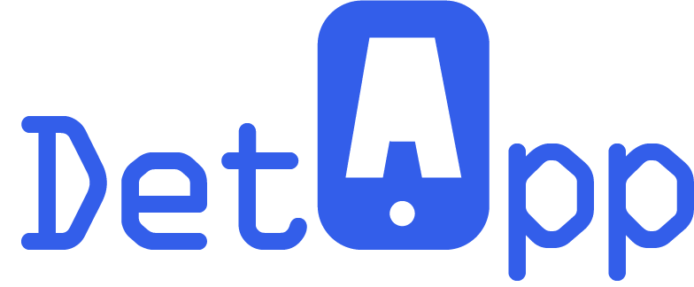

# CS2024 App developement website
 
|
 |
 |
 |
| --- | --- | --- |

# Creative Brief

Ong Cai Wen (U1722926L) - SEO +Writing

Phone number: 84921860 email: [ongcaiwen@gmail.com](mailto:ongcaiwen@gmail.com)

Chng Wee Ping (U1722887D) – Web Developer/Designer

Phone number: 98765163 email: [i170006@e.ntu.edu.sg](mailto:i170006@e.ntu.edu.sg)

Poon Xin Yi (U1720976F) - Illustrations

Phone number: 96259792 email: [Xpoon001@e.ntu.edu.sg](mailto:Xpoon001@e.ntu.edu.sg)

Theophilus Kwek (U1721195E) - Project Manager

Phone number: 96844796 email: theo0007@e.ntu.edu.sg

# Table of Contents

**[Creative Brief 1](#_Toc56293935)**

**[Company Background: 3](#_Toc56293936)**

**[Target Audiences: 3](#_Toc56293937)**

**[Objectives: 3](#_Toc56293938)**

**[Details: 3](#_Toc56293939)**

**[Bootstrap 5 alpha 4](#_Toc56293940)**

**[Font 4](#_Toc56293941)**

[Feather 4](#_Toc56293942)

[HK Grotesk Pro 4](#_Toc56293943)

**[Illustrations: 5](#_Toc56293944)**

[Logo 5](#_Toc56293945)

[Services 5](#_Toc56293946)

[Development Process 6](#_Toc56293947)

**[SEO: 8](#_Toc56293948)**

**[Google Analytics 19](#_Toc56293949)**

**[Hosting 22](#_Toc56293950)**

[What is Firebase Hosting? 22](#_Toc56293951)

[Why did we use it? 22](#_Toc56293952)

[Set up production workflows 23](#_Toc56293953)

[Automate continuous deployment with Cloud Build 23](#_Toc56293954)

**[Project Management and team contribution 26](#_Toc56293955)**

[Project Manager: Theophilus Kwek 26](#_Toc56293956)

[Developer: Chng Wee Ping 26](#_Toc56293957)

[Illustrator: Poon Xin Yi 26](#_Toc56293958)

[SEO Writer: Ong Cai Wen 26](#_Toc56293959)

# Company Background:

DetApp is a professional mobile app development company specializing in handling projects from clients to develop mobile applications.

As smartphones have become a basic life necessity for most people, the applications that runs in smartphones have also become part of the necessities.

Our company started with a goal to provide Mobile Development services for Enterprises and Startups to help clients bring their ideas to reality in the form of impressive mobile apps for Android, iOS, and other platforms.

# Target Audiences:

Clients who are looking to create mobile application but do not have the exact skills to execute.

Anyone who wish to create a mobile app. People who wish to join DetApp as part of the developer team.

# Objectives:

Attracting people to commission mobile app development project with us by showcasing our portfolio of previous projects.

Attracting more talents to join the company with showing company&#39;s working environment, and company benefits.

# Details:

## Bootstrap 5 alpha

Currently **v5.0.0-alpha2**

We have decided to use bootstrap 5 alpha to future proof this project. It is just like getting the latest iPhone model every year, because the newer one is just better. This does not imply that that bootstrap v4 is bad or anything, we just wanted to set our base on a newer model that&#39;s all.

Here are some of the main perks of bootstrap 5:

1. CSS variables
2. Faster JavaScript
3. Fewer dependencies
4. Better APIs

One of the main differences between bootstrap 5 and 4 is that bootstrap 5 has no jQuery in it. jQuery is an extremely useful tool that has made complex JavaScript codes way easier. However, because of newer and better technologies in front-end web development tools and browser support, bootstrap is now able to drop jQuery as a dependency. This makes the entire bootstrap file smaller and thus faster.

## Font

### Feather

### HK Grotesk Pro

## Illustrations:

### Logo

This is the logo design based on our Company name &#39;DetApp&#39;, we want to display our name in the logo to allow customers to know our company name at one glance. And to show that we are doing work related to Mobile, we designed the A in a mobile phone shape using the Gestalt Principles of Design to allow viewers&#39; eyes to perceive the shape in white as an &#39;A&#39; by following the outline of it. It is also designed based on our website color scheme.

### Services

There are two icons in the home page to show what we can do for the customers.

This icon is designed with a tool icon to represent that we are here to help customers build a strategy for their business idea or product with the right feature set.

This icon is designed to emphasize that we provide mobile app development services. Our team of app developers makes amazing Android, iOS and Hybrid mobile apps.

This is designed with a paintbrush and pencil tool to represent that our designers can create unique mobile app designs to offer an unforgettable user experience according to our customers&#39; requirements.

### Development Process

We also have illustrations to represent the steps of how DetApp processes customer&#39;s Mobile App Development project.

We have three steps as follows:

1. **Requirement Gathering &amp; Wireframe**

This illustration is designed based on how DetApp will discuss with our customers about their mobile app and requirements then we will have an idea of how to build the wireframes to allow the customers to understand the flow of the mobile app.

1. **Mobile App Design &amp; Development**

Next illustration is designed based off how DetApp&#39;s designers &amp; developers will add components to the applications to bring the app to life. It is like construction field in building something.

1. **Testing &amp; Deployment**

And the final step of the process would be Testing &amp; Deployment of the mobile application. This illustration is designed to represent the testing and debugging step of the development, this step is called User Acceptance Tests to ensure the application is in best condition.

The illustrations within Phone and MacBook are to represent that DetApp supports Responsive Web Design, and we have implemented Responsive Web Design in our website layout to allow customers to view our contents on a smaller screen device without any contents being distorted.

## SEO:

This is before optimization of images and CSS

After optimizing images and CSS

By optimizing the components of the website, visitors can load and view our website faster and shorten the waiting time of loading the pages. This is part of conversion rate optimization where we practice improving the quality of visitors and encompass usability, copywriting, statistics, testing and research.

Visitors often feel obligated to give back others who have given to them. In our website, it teaches our visitors something useful and value add to them long enough before selling them anything. We ensure our visitors feel reciprocated across all our web pages.

At Home Page, we ensure that we provide the best services that they will be paying for.

 

###

About Page

 

###

Opening Page

Once we make a choice/take a stand, we will encounter personal and interpersonal pressure to behave consistently with that commitment.

In our specialty page (which is very first page in navigation bar), we started small and move up from there in our subsequent pages (ios/android pages and our showcase/portfolio page) by selling something small first (a no-brainer deal). Visitors now see themselves as our customer and will be much more likely to return to make a larger purchase.

We only emphasize on what we do best in our specialty page.

Thereafter, we show what we are capable to build in ios and android pages by attaching a video of our end product for companies, together with the key features of the app. This is part of demonstrating that DetApp is a team with superior knowledge and produces credible results.

 

In our showcase page, visitors can view that we have worked local government agencies, which make DetApp a very reliable mobile app development company. This is part of demonstrating our expertise.

Details of a few work are also described at the bottom of this page. Similarly, key features of the outcome are narrated to convey that DetApp has many to offer.

Social Proof: People decide what is appropriate for them to do in a situation by examining and following what others are doing. Our web page shows how many others are already using our product, and we show off our numbers, as well as attaching testimonials.

Headlines: The purpose of the headline is to get your viewer to read the first sentence. Every headline should call for attention. &quot;Attention&quot; simply means mental focus and serious concentration on a given task. Here are four rules we follow. They&#39;re considered the &quot;4 U&#39;s&quot; of writing attention-driven headlines:

The four U&#39;s are:

- Make the headline unique
- Be ultra-specific
- It should convey a sense of urgency
- Headline must be useful

We state the obvious in our headline: headlines that are easy to understand. The moment a potential reader stumbles on our web page from anywhere, they do not need any help to figure out what we are trying to convey. The purpose of the headline is to get people to click, so that you can earn a better ROI. The purpose is _not_ to appear clever or educated.

Then, our subheads tell the story of the copy.

We ensure we tell our visitors exactly what we want them to do by spelling out as clearly as possible in DetApp. We used direct and action-oriented words:

1. Apply
2. Enquire Now
3. Join Us Now
4. Load More
5. Refer a Friend
6. Search
7. Speak to us now
8. View Open Positions
9. View Our Portfolio

These calls for action are attached to buttons so we focus on what visitors are trying to get and stay specific and relevant.

Valuable, relevant headlines and buttons are critical, but we can often increase conversions even more with an additional sentence or two touting the biggest benefits of completing the form. For DetApp, we do so by having a form for visitors to type their concerns/their career application at contactus.html and applytous.html.

(Contact Us Page)

(Apply to Us . Html)

 

##

## Google Analytics

  

## Hosting

Firebase was used for hosting

Links to the website:

[detapp-85d13.web.app
](http://detapp-85d13.web.app/)[detapp-85d13.firebaseapp.com](http://detapp-85d13.firebaseapp.com/)

### What is Firebase Hosting?

Firebase Hosting is a fully-managed hosting service for static and dynamic content as well as microservices. The service is backed by SSD storage and a global CDN (content delivery network). Zero-configuration SSL is built into Firebase Hosting, so content is always delivered securely.

### Why did we use it?

We benefit from Firebase Hosting&#39;s unique optimization for serving single-page web apps and static websites. Delivery of static assets (HTML, CSS, JavaScript, fonts, etc.) is powered by Google&#39;s SSD backend storage and a global CDN with edge locations across all major locations in the world. Google can even cache our dynamic content on the global CDN. All sites hosted by Firebase also get a free SSL certificate, so our content is always delivered securely.

### Set up production workflows

Before deploying to the live site, we want to view and test some changes. Firebase Hosting enables us to view and test changes locally and interact with emulated backend project resources. If I need my teammates to view and test my changes, Hosting can create sharable, temporary preview URLs for my site.

### Automate continuous deployment with Cloud Build

Firebase Hosting partnered with Cloud Build offers a DevOps-ready solution for automating a continuous deployment workflow for our static and dynamic content.

We can deploy your web app to Firebase Hosting by simply checking in the code to our git repository.

 Example of the deployment to detApp

## Project Management and team contribution

GitHub projects was used to assign and delegate task to the respective members.

Everyone in this group played an important role in the creation of the website.

### Project Manager: Theophilus Kwek

In charge of the project management as well as handling half of the coding/programming of the website.

### Developer: Chng Wee Ping

Develop web pages in accordance with the theme set out by the Project Manager, as well as additional features for the website. Wee Ping was also in charge of Quality testing/assurance. He would even fix some of the issues or bugs that he found.

### Illustrator: Poon Xin Yi

In charge of creating original illustrations for the website, and compressing the images for SEO requirements.

### SEO Writer: Ong Cai Wen

In charge of creating innovative and engaging content for all web pages; Content marketing strategy analysis; Writing search engine optimized copy and optimizing current copy.

|
 |
 |
 |
| --- | --- | --- |

Links to the website
http://detapp-85d13.web.app/
http://detapp-85d13.firebaseapp.com/
